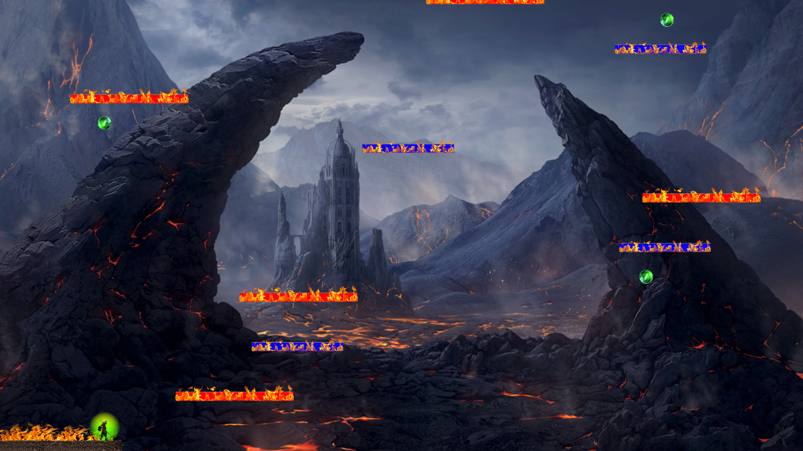
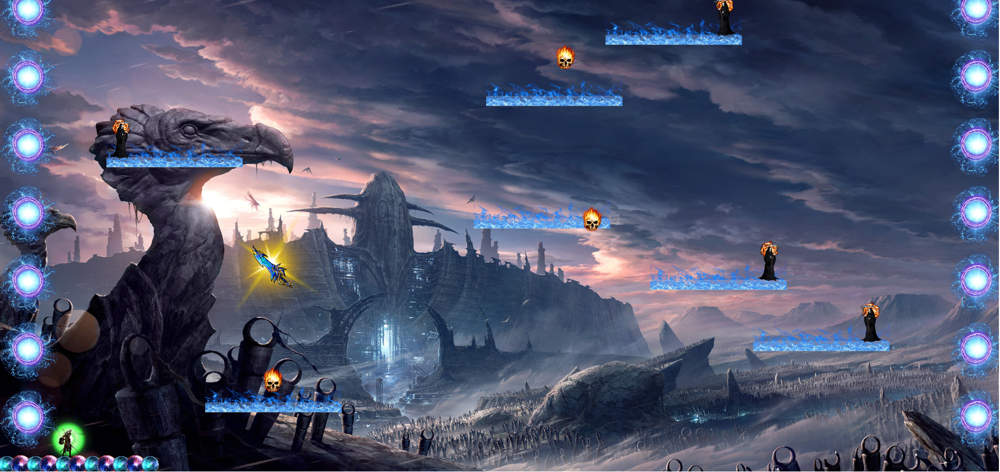
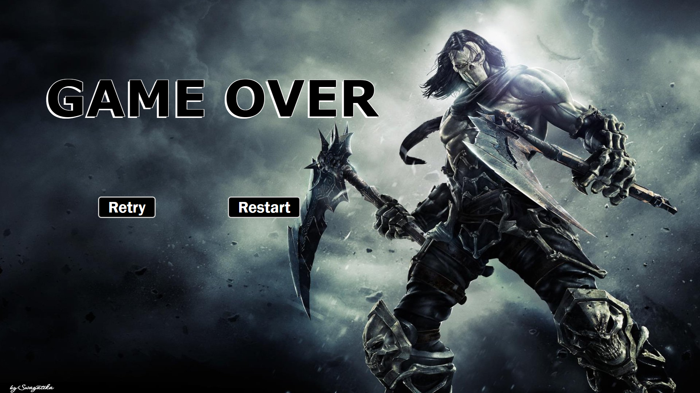
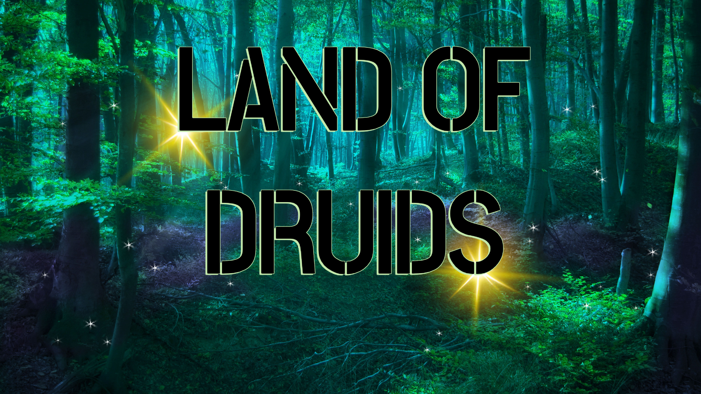

# Abyss

This is a 2D game, created using JavaScript, HTML, CSS, and p5 libraries.

## Game Story

Alux has left on the quest to the land of Druids, to his mother. To know how is he a druid? What are his powers? Why doesn't he has any control over them? Many questions and one destination. But before entering the land of Druids, he has to go through Abyss... He got to enter it alive , and defeat his seven deaths to enter the land of druids. Remember, it is neither facile nor forlorn, and either way you are right.

#### 🔗 Game Link >>> (https://swag3009.github.io/Abyss/){:target="_blank" rel="noopener"}

## Screenshots
Start Screen: 

Level - 1 Screen:

Level - 2 Screen:

Game Over Screen:

Win Screen:

## 🔗 My Profile Links
Discord Username --> Swag3009#3771

